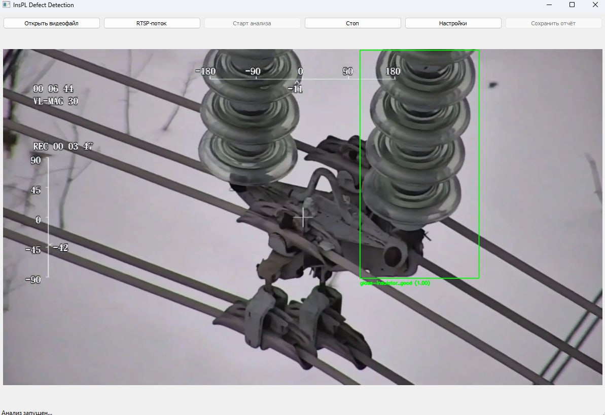

# InsPL Defect Detection

*Общий вид приложения (пример)*

## Описание проекта

**InsPL Defect Detection** (Inspection of Power Lines Defect Detection) — это программное обеспечение для автоматизированного анализа видеоданных с линий электропередачи (ЛЭП) с целью выявления дефектов на проводах и опорах линий передач.  
Система использует алгоритмы на базе нейронных сетей для:
- автоматического обнаружения объектов на кадрах видео,
- классификации состояния объектов (наличие дефектов, тип дефекта),
- формирования наглядных отчетов по результатам диагностики.

**Цель проекта:**  
Существенно повысить точность и скорость анализа видеоматериалов, упростить мониторинг и обслуживание ЛЭП, снизить человеческий фактор и затраты на инспекцию.

**Ожидаемый результат:**  
Готовое desktop-приложение с понятным GUI, поддержкой видеофайлов и RTSP-потоков, автоматическим формированием Excel-отчетов с примерами кадров и подробной статистикой по дефектам.

---

## Технологический стек

- **Язык программирования:** Python 3.8+
- **Фреймворк GUI:** PyQt5
- **Компьютерное зрение:** OpenCV, Ultralytics YOLOv11
- **Работа с данными:** pandas, numpy
- **Отчеты:** openpyxl (экспорт в Excel)
- **Модели:** YOLOv11 (обнаружение объектов и классификация)
- **Формат данных:** COCO (детекция), ImageNet-style (классификация)
- **Протоколы:** RTSP (поддержка потокового видео)
- **Системы хранения:** Локальная файловая система (чекпоинты, отчеты)
- **Сборка:** requirements.txt (pip)

---

## Описание датасета

### Детекция объектов (COCO-формат)
- **train:** `./train/images`, разметка — `./train/labels`
- **val:** `./val/images`, разметка — `./val/labels`
- **Классы (18):**
  - yoke, yoke suspension, spacer, stockbridge damper, lightning rod shackle, lightning rod suspension, polymer insulator, glass insulator, tower id plate, vari-grip, polymer insulator lower shackle, polymer insulator upper shackle, polymer insulator tower shackle, glass insulator big shackle, glass insulator small shackle, glass insulator tower shackle, spiral damper, sphere

### Классификация дефектов (ImageNet-style)
- **Папки-классы:** каждый класс дефекта — отдельная папка с изображениями
- **Классы (11):**
  - yoke-suspension_good, yoke-suspension_rust, vari-grip_good, vari-grip_rust, polymer-insulator-upper-shackle_rust, vari-grip_bird-nest, polymer-insulator-upper-shackle_good, glass-insulator_missing-cap, lightning-rod-suspension_good, lightning-rod-suspension_rust, glass-insulator_good

## Архитектура и структура модели

- **Детектор:** YOLOv11 (18 классов объектов)
- **Классификатор:** YOLOv11-классификатор (11 классов дефектов/состояний)
- **Inference pipeline:**
  1. На каждом кадре видео выполняется детекция объектов (детектор).
  2. На каждую найденную область применяется классификатор дефектов.
  3. Результаты фильтруются по порогам достоверности (good/defect).
  4. Визуализация и сбор статистики для отчета.

**Схема работы:**
[Видео/RTSP] → [Детектор YOLOv11] → [Классификатор YOLOv11] → [Фильтрация] → [GUI/Отчет]

---

## Итоговые метрики

| Модель         | mAP@0.5 (детекция) | Accuracy (классификация) | Recall | Precision |
|----------------|--------------------|--------------------------|--------|-----------|
| YOLOv11n       | 0.88               | 0.99                     | 0.85   | 0.87      |

*Точные значения метрик и графики обучения приведены ниже.*

[График обучения детектора](docs/loss_curve_detector.png)
[График обучения классификатора](docs/acc_curve_classifier.png)

---

## Лайв-демо и запуск

### Видео-демонстрация

  
*Кликните для просмотра видео-демонстрации работы системы.*

### Запуск приложения

1. *Установите зависимости:*
pip install -r requirements.txt

2. *Подготовьте веса моделей:*
    - Скачайте предобученные чекпоинты YOLO (или обучите с нуля с помощью `train_detector.py` и `train_classifier.py`).
    - Поместите их по путям, указанным в `config.json`.

3. *Запустите приложение:*
 python main.py

4. *Используйте GUI:*
    - Откройте видеофайл или RTSP-поток.
    - Запустите анализ.
    - После завершения — сохраните Excel-отчет с примерами кадров и статистикой.

## Презентация проекта

[Ссылка на презентацию (Yandex Disk)](https://disk.yandex.ru/d/SalNI2q1F-pofw)

## Дополнительные материалы

- [YOLOv11 (Ultralytics) — документация](https://docs.ultralytics.com/models/yolo11/)
- [Пример отчета (Excel)](docs/example_report.xlsx)
